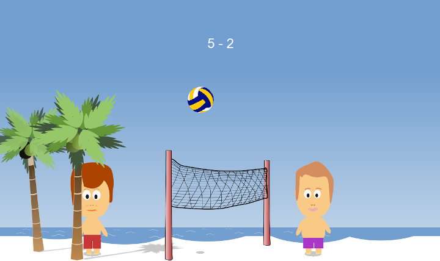

# Volley

## Description

A volley-ball 2D game built from scratch with multithreaded C++ using [SFML](https://www.sfml-dev.org/).



## Installation

:warning: Code is written for Linux only.

### Dependencies

This project uses `cmake` and SFML library:
```
sudo apt-get install cmake libsfml-dev
```
## Build

1. Clone this repository
2. Compile with `mkdir build && cd build && cmake ..`
3. Go to binary folder `cd ./bin`
4. Run with `./volley`

## Game Design

This game was made for fun but also to practice multithreading in C++ and implementing various OOP design patterns.

### Resources

All images come from [openclipart.org](https://openclipart.org/), except characters which are an home-made creation.

### General

There are 3 threads which handle the different parts of the game:  
- the **rendering thread** handles rendering the game window at a rate of about 60 fps,
- the **event thread** handles interpreting user input once every 50ms,
- the **game thread** updates the game state once every 60 fps.
